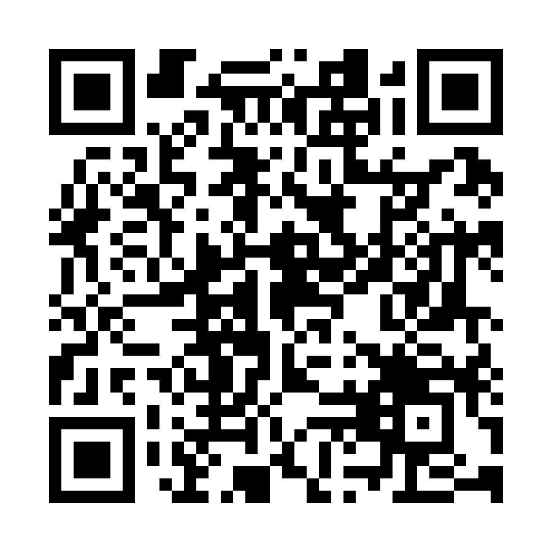

<p align="center">
  <a href="./README.md">English</a> · Español
</p>

<p align="center">
  <a href="https://cybergems.org/apps/cybersnap/">
    
  </a>
</p>

<p align="center">
  <a href="https://github.com/CyberGems/CyberSnap/releases/latest"></a>
  &nbsp;<a href="https://github.com/CyberGems/CyberSnap/releases"></a>
</p>

<p align="center">
  &nbsp;
  &nbsp;
  &nbsp;
  <a href="https://github.com/CyberGems/CyberSnap/wiki"></a>
</p>

---

## ¿Qué es CyberSnap?

CyberSnap es una **suite de captura y anotación de pantalla** todo en uno para Windows, creada para llevar una captura desde el primer clic hasta el resultado final sin interrumpir tu flujo de trabajo. Captura áreas, ventanas, pantallas completas o contenido con desplazamiento; graba MP4 o GIF; anota con herramientas vectoriales; extrae y traduce texto con OCR; y muestrea colores de pantalla. Una galería local con búsqueda, recorte de vídeo integrado y múltiples destinos de subida hacen que las capturas pasadas sean fáciles de encontrar, refinar y compartir. Construido con **.NET 9** y **WPF**.

*Gratuito y de código abierto (GPLv3): sin anuncios, sin rastreo y sin recogida de datos. Solo disfrútalo.*

---

## 📸 ¿Por qué CyberSnap?

La mayoría de las herramientas de captura hacen muy poco o esconden funciones detrás de un pago. CyberSnap te da **captura, edición y compartir de grado profesional**, incluidas herramientas vectoriales, OCR de alta velocidad, grabación de pantalla y un selector de color, todo en un paquete gratuito y de código abierto con un diseño pulido y moderno.

| Necesidad | Solución |
|---|---|
| Captura cualquier cosa | Área, ventana, pantalla completa, captura con desplazamiento, grabación MP4/GIF |
| Edita y anota | Editor completo con formas, texto, reglas, colores y marcos |
| Extrae texto de imágenes | OCR multilingüe con Tesseract + traducción integrada |
| Encuentra capturas pasadas | Índice SQLite local con búsqueda de texto completo en el contenido de OCR |
| Exportación a múltiples destinos | FTP, SFTP, S3, ImgBB, Imgur, Webhook o CyberSnap Share |
| Trabaja eficientemente | Atajos configurables, widget flotante, inicio automático, bandeja del sistema |

---

## ✨ Funciones principales

### 📷 Captura
- **Widget de captura flotante**: widget siempre disponible en pantalla para capturar con un clic
- **Modos de captura flexibles**: área, ventana activa, pantalla completa y captura con desplazamiento (páginas largas cosidas en una sola imagen)
- **Grabación de pantalla**: graba en MP4 o GIF con un recortador de vídeo completo (tira de fotogramas, forma de onda, corte preciso)
- **Herramientas de precisión**: guías de cruz, lupa de captura y detección inteligente de ventanas
- **Captura con desplazamiento**: cose automáticamente páginas largas con desplazamiento en una sola imagen

### ✏️ Editor de anotaciones
- **Lienzo enriquecido**: formas, texto, pegado de imágenes, reglas, colores personalizados y marcos
- **Apertura automática**: se abre automáticamente después de cada captura (configurable)
- **Deshacer/rehacer**: límite de historial configurable (1–200 pasos)
- **Tiradores de redimensionado**: escala el contenido o extiende el lienzo
- **Modo de desplazamiento**: con bloqueo de objetos opcional

### 🔤 OCR y traducción
- **OCR multilingüe**: extrae texto de imágenes con Tesseract
- **Detección automática de idioma**: basada en el idioma de visualización de Windows
- **Traducción integrada**: traduce el texto extraído con OCR con idiomas de origen/destino configurables
- **Búsqueda local**: búsqueda de texto completo en todo el contenido de OCR de tu historial de capturas

### 📊 Galería e historial
- **Historial persistente**: capturas, texto de OCR, códigos y colores con retención configurable
- **Búsqueda**: encuentra capturas pasadas por contenido, texto de OCR o metadatos
- **Acciones al hacer clic**: abre en el editor, copia al portapapeles o abre en el visor predeterminado
- **Indexación automática**: índice local SQLite con fuentes de búsqueda configurables

### 📤 Subida y compartición
- **7 destinos**: FTP, SFTP, compatible con S3, ImgBB, Imgur, Webhook o CyberSnap Share
- **Credenciales cifradas**: almacenamiento protegido por el SO (DPAPI de Windows) para las credenciales de los proveedores de subida
- **Formato configurable**: PNG o JPEG con control de calidad
- **Acciones posteriores a la subida**: abre la URL en el navegador tras una subida exitosa

### 🛠️ Herramientas independientes
- **Selector de color**: muestrea cualquier color de la pantalla con vista de detalle HEX/RGB/HSL y copia por fila
- **Regla**: herramienta de medición en pantalla
- **Escáner de códigos de barras / QR**: escanea códigos de forma independiente o sobre una captura

### 🖥️ Integración con el escritorio
- **Bandeja del sistema**: se ejecuta en segundo plano con menú contextual personalizado
- **Atajos configurables**: capturas de área, centro, pantalla completa, ventana, desplazamiento y repetición, grabación de pantalla, más lanzadores independientes de OCR, selector de color, QR y regla
- **Inicio automático**: se inicia al iniciar sesión en Windows
- **Actualización automática**: actualizador integrado con avisos emergentes, vista previa del changelog y omisión por versión
- **Asistente de configuración**: asistente de configuración en el primer uso

### 🎨 Personalización
- **28 idiomas**: localización completa de la interfaz (incluidos inglés y español)
- **4 temas**: oscuro de firma, escala de grises, claro y siguiendo al sistema
- **Escala de interfaz ajustable**: adapta a cualquier pantalla
---

## 🚀 Primeros pasos

### Instalación

Descarga el [instalador de Inno Setup](https://github.com/CyberGems/CyberSnap/releases/latest) y sigue el asistente. El instalador registra las asociaciones de archivos `.csnp`, crea accesos directos y ofrece iniciar con Windows.

El instalador y el [zip portable](https://github.com/CyberGems/CyberSnap/releases/latest) funcionan por sí solos:

- **.NET 9 Desktop Runtime** está dentro de `CyberSnap.exe`. Instalar .NET por separado solo es necesario cuando compilas CyberSnap desde el código fuente.
- **FFmpeg** es el archivo `ffmpeg.exe` situado junto a `CyberSnap.exe`. Lo usan la grabación MP4, la codificación GIF, el recortador de vídeo y las formas de onda de audio. No necesitas instalar FFmpeg tú mismo, ni añadirlo al `PATH`.

Si Windows muestra **«You must install .NET Desktop Runtime to run this application»** para `CyberSnap.exe`, esa copia se compiló sin el runtime incluido. `dotnet build` produce ese tipo de ejecutable, y también un publish que omite `--self-contained true`. En un PC que ya tiene el .NET 9 Desktop Runtime, ambas copias arrancan, así que el runtime faltante solo se muestra en una máquina limpia. La build de release se comprueba para confirmar el runtime incrustado antes de empaquetarse. Los detalles del archivo FFmpeg, su licencia y cómo reemplazarlo están en [third-party/ffmpeg/README.md](third-party/ffmpeg/README.md).

### 🛡️ Windows SmartScreen

Windows puede mostrar un aviso de SmartScreen la primera vez que ejecutas el instalador de CyberSnap: esta es una app de hobby sin firmar, así que Windows aún no ha construido reputación para el archivo. Esto es esperado; el código fuente es público para que puedas inspeccionar exactamente qué hace. Lo mismo puede ocurrir al lanzar la versión portable.

Para continuar:

<details>
<summary><strong>Cómo ejecutar el instalador (paso a paso)</strong></summary>

Windows muestra este aviso para cualquier instalador sin un certificado de firma de código de pago; no significa que el archivo sea inseguro. No hagas clic en "No ejecutar":

1. Ejecuta el instalador. Windows puede mostrar el diálogo azul "Windows protegió tu PC".


2. Haz clic en el pequeño enlace **Más información**.


3. Haz clic en **Ejecutar de todos modos**. El instalador arranca con normalidad.

Puedes verificar el archivo de forma independiente: compara el SHA con el release de GitHub, escanéalo en VirusTotal o compila desde el código fuente. Más detalles: [guía de SmartScreen en el sitio web](https://cybergems.org/download#smartscreen).

</details>
---

## 🛠️ Stack tecnológico y arquitectura

- **Plataforma:** Windows 10 (compilación 19041) o posterior: x64, x86, ARM64
- **Framework:** .NET 9 + WPF (alto DPI PerMonitorV2). El instalador y el [zip portable](https://github.com/CyberGems/CyberSnap/releases/latest) ya incluyen el .NET 9 Desktop Runtime.
- **Grabación:** FFmpeg 9.0.2 essentials (`ffmpeg.exe`, con libx264), incluido junto a la app. Ver [third-party/ffmpeg/README.md](third-party/ffmpeg/README.md).
- **Base de datos:** SQLite (historial local e índice de búsqueda)
- **Captura:** DirectX mediante Vortice.Direct2D1 / Vortice.Direct3D11
- **OCR:** Tesseract
- **Códigos de barras:** ZXing.Net
- **Instalador:** Inno Setup

```
CyberSnap/
├── src/
│   ├── CyberSnap/              App principal (WPF, punto de entrada)
│   │   ├── App.xaml/.cs        Definición de la aplicación y entrada principal
│   │   ├── Capture/            Captura, superposición, grabación, captura con desplazamiento
│   │   ├── Services/           Servicios de lógica de negocio
│   │   │   ├── Upload/         Proveedores de subida (FTP, SFTP, S3, ImgBB, Imgur, Webhook)
│   │   │   ├── History/        Gestión del historial
│   │   │   ├── HotkeyService.cs
│   │   │   ├── OcrService.cs
│   │   │   ├── TranslationService.cs
│   │   │   └── SettingsService.cs
│   │   ├── UI/                 Ventanas y controles
│   │   │   ├── Editor/         Editor de anotación
│   │   │   ├── Settings/       Ventana de configuración
│   │   │   ├── History/        Ventana de galería/historial
│   │   │   └── Share/          Diálogos para compartir
│   │   ├── Localization/       28 archivos de idioma JSON
│   │   ├── Models/             Modelos de datos
│   │   ├── Helpers/            Ayudantes de utilidad
│   │   └── Native/             Interop nativo
│   └── CyberSnap.AppModel/     Modelos compartidos y esquemas de configuración
├── scripts/                    Comprobaciones de release, descarga de FFmpeg incluido, helper de clave de subida
├── third-party/ffmpeg/         Qué build de FFmpeg se incluye y por qué
├── CyberSnap.iss               Script del instalador Inno Setup
└── CyberSnap.sln               Solución
```

### Compilar desde el código fuente (desarrolladores)

Solo necesario si quieres modificar CyberSnap o compilarlo tú mismo; los usuarios normales pueden omitir esta sección.

#### Requisitos previos

.NET 9 SDK, Windows 10 SDK (10.0.19041.0+), Visual Studio 2022 o la CLI `dotnet`

```powershell
# Compilar (Debug). Este exe necesita el .NET 9 Desktop Runtime en la máquina donde se ejecuta.
dotnet build src/CyberSnap/CyberSnap.csproj

# Publicar autocontenido para x64. Esto es lo que puede ejecutar un PC limpio.
dotnet publish src/CyberSnap/CyberSnap.csproj `
  -c Release -r win-x64 `
  --self-contained true `
  -p:PublishSingleFile=true `
  -o ./publish-win64

# Coloca el ffmpeg.exe fijado, su licencia y el aviso junto a ese publish.
./scripts/Get-BundledFfmpeg.ps1 -Destination ./publish-win64
```

Compila el instalador con [Inno Setup](https://jrsoftware.org/isinfo.php) desde `CyberSnap.iss`. El script empaqueta lo que haya en `publish-win64`, incluido `ffmpeg.exe`.
---

## ⌨️ Atajos de teclado

Las capturas, la grabación y las herramientas independientes exponen atajos configurables en **Ajustes → Teclado**. Solo Selección de área trae uno por defecto:

| Acción | Atajo predeterminado |
|---|---|
| Selección de área | `Alt+Shift+A` |
| Desde el centro | Sin asignar |
| Captura de pantalla completa | Sin asignar |
| Ventana activa | Sin asignar |
| Captura con desplazamiento | Sin asignar |
| Repetir última área | Sin asignar |
| Grabador de pantalla (MP4) | Sin asignar |
| Grabador de pantalla (GIF) | Sin asignar |
| OCR independiente | Sin asignar |
| Selector de color independiente | Sin asignar |
| QR y códigos de barras independiente | Sin asignar |
| Regla independiente | Sin asignar |

Abre el editor de anotaciones directamente: `CyberSnap.exe --editor`

---

## 🤝 Contribuir

Las contribuciones son bienvenidas. Abre un issue describiendo el cambio antes de empezar trabajos grandes y envía pull requests contra la rama principal.

## 🙏 Agradecimientos

Originalmente hace un fork de [OddSnap](https://github.com/jasperdevs/odd-snap) de [jasperdevs](https://github.com/jasperdevs). Desde entonces, CyberSnap ha sido reescrito y ampliado extensamente por [CyberGems](https://cybergems.org/).

Este proyecto también se construye sobre componentes de código abierto como Tesseract OCR, ZXing, SQLite, FFmpeg, x264 e Inno Setup, gracias a sus autores y mantenedores. El binario de FFmpeg incluido con CyberSnap es la build essentials GPLv3 documentada en [third-party/ffmpeg/README.md](third-party/ffmpeg/README.md).

---

## ❤️ Donar

Tras incontables horas construyendo y perfeccionando **CyberSnap** para mi propio uso, decidí recientemente compartirlo con el mundo junto a mis otras herramientas de código abierto en [CyberGems](https://github.com/CyberGems#-all-apps--repositories).

Si te gustaría apoyar las futuras actualizaciones, te lo agradecería de verdad. Tu donación ayuda a mantener el desarrollo, lanzar nuevas funciones, acelerar la resolución de actualizaciones y errores, y mejorar la calidad de la documentación. También puedes mostrar tu apoyo [poniendo una estrella al repo en GitHub](https://github.com/CyberGems/CyberSnap). ¡Gracias! 🙏

<p align="center">
  <a href="https://www.paypal.com/donate/?hosted_button_id=M4PY3UPJA5Y6Q"></a>
</p>

<p align="center">
  <a href="https://ko-fi.com/cybergems"></a>
</p>

<p align="center">
  <a href="https://buymeacoffee.com/cybergems"></a>
</p>

<div align="center">

<details>
<summary><b>Donaciones cripto (BTC, ETH, USDT, LTC): haz clic para ver las direcciones</b></summary>

| Activo | Dirección | QR |
|---|---|---|
| **BTC** | <pre><code>bc1q5mxzz05nmvsheqzx7970euswta3fksxzcfzag4</code></pre> |  |
| **ETH** | <pre><code>0x79b703Ec0f77493679Fcd280aF3b983E20c580B8</code></pre> |  |
| **USDT (ERC20 / BEP20)** | <pre><code>0x79b703Ec0f77493679Fcd280aF3b983E20c580B8</code></pre> |  |
| **USDT (TRC20)** | <pre><code>TSVbSk1HSyZ1NprCnAYiw56ECwXgH887mD</code></pre> |  |
| **LTC** | <pre><code>LWGnEHgcFCE2BRkzLnsdPDD8Y8ZeDK577X</code></pre> |  |

> ⚠️ Envía solo el activo seleccionado en la red indicada. Usar la red incorrecta provocará la pérdida permanente de fondos.

</details>

</div>
---

## 📄 Licencia

CyberSnap se distribuye bajo los términos de la Licencia Pública General GNU v3.0. Consulta [`LICENSE`](LICENSE) para el texto completo de la licencia.

Copyright (C) 2026 CyberGems

---

## ❓ Preguntas frecuentes

Para preguntas frecuentes, guías de solución de problemas e instrucciones detalladas de configuración, visita las [Preguntas frecuentes](https://github.com/CyberGems/CyberSnap/wiki/FAQ) o la [documentación en línea](https://cybergems.org/docs/cybersnap/FAQ).

---

<div align="center" style="background:#0D0F17; border:1px solid rgba(0,255,255,0.12); border-radius:12px; padding:28px 20px; margin-top:32px;">

### ¡Gracias por usar CyberSnap! 🎉

Creado por [**CyberGems**](https://cybergems.org)

</div>
<p align="center">
  <a href="https://www.reddit.com/submit?url=https%3A%2F%2Fcybergems.org%2Fapps%2Fcybersnap%2F&title=CyberSnap%3A%20herramienta%20de%20escritorio%20gratuita%20y%20de%20c%C3%B3digo%20abierto%20para%20Windows"></a>
  &nbsp;<a href="https://twitter.com/intent/tweet?text=CyberSnap%3A%20herramienta%20de%20escritorio%20gratuita%20y%20de%20c%C3%B3digo%20abierto%20para%20Windows&url=https%3A%2F%2Fcybergems.org%2Fapps%2Fcybersnap%2F"></a>
  &nbsp;<a href="https://www.facebook.com/sharer/sharer.php?u=https%3A%2F%2Fcybergems.org%2Fapps%2Fcybersnap%2F"></a>
  &nbsp;<a href="mailto:?subject=CyberSnap%3A%20herramienta%20de%20escritorio%20gratuita%20y%20de%20c%C3%B3digo%20abierto%20para%20Windows&body=CyberSnap%3A%20herramienta%20de%20escritorio%20gratuita%20y%20de%20c%C3%B3digo%20abierto%20para%20Windows%20https%3A%2F%2Fcybergems.org%2Fapps%2Fcybersnap%2F"></a>
  &nbsp;<a href="https://t.me/share/url?url=https%3A%2F%2Fcybergems.org%2Fapps%2Fcybersnap%2F&text=CyberSnap%3A%20herramienta%20de%20escritorio%20gratuita%20y%20de%20c%C3%B3digo%20abierto%20para%20Windows"></a>
  &nbsp;<a href="https://www.linkedin.com/sharing/share-offsite/?url=https%3A%2F%2Fcybergems.org%2Fapps%2Fcybersnap%2F"></a>
</p>

---

## 🔗 Ver también

Más aplicaciones gratuitas, de código abierto y con la privacidad primero de [**CyberGems**](https://github.com/CyberGems):

| App | Descripción |
|:---:|---|
| 🕐&nbsp;[**CyberClock**](https://github.com/CyberGems/CyberClock#readme) | Reloj de escritorio con analógico y digital, calendario, temporizador, cronómetro y módulo de relajación. |
| 📢&nbsp;[**CyberFeeds**](https://github.com/CyberGems/CyberFeeds#readme) | Lector RSS y Atom de alto rendimiento y local-first, creado para la velocidad, la privacidad y la lectura limpia. |
| 🚀&nbsp;[**CyberLauncher**](https://github.com/CyberGems/CyberLauncher#readme) | Lanzador de aplicaciones de Windows con esquinas calientes, programador, monitor de sistema y terminal integrada. |
| 💻&nbsp;[**CyberManager**](https://github.com/CyberGems/CyberManager#readme) | Gestor de tareas ligero y de alto rendimiento, virtualizado y nativo de NT, una potente alternativa al Administrador de Tareas. |
| 📝&nbsp;[**CyberNotes**](https://github.com/CyberGems/CyberNotes#readme) | App de notas centrada en la privacidad con texto enriquecido, carpetas, pestañas y almacenamiento local protegido con bcrypt. |
| ⚡&nbsp;[**CyberPaste**](https://github.com/CyberGems/CyberPaste#readme) | Gestor de portapapeles con la privacidad primero para texto, código, imágenes, HTML y archivos. |
| ⭐&nbsp;[**CyberTray**](https://github.com/CyberGems/CyberTray#readme) | Lanzador de bandeja de alto rendimiento con hotspots, monitoreo de sistema, gestor de procesos y bóveda de archivos protegida con PIN. |
| 💫&nbsp;[**CyberViewer**](https://github.com/CyberGems/CyberViewer#readme) | Visor y editor de imágenes completo diseñado para usuarios casuales y avanzados. |
| 🛡️&nbsp;[**CyberWall**](https://github.com/CyberGems/CyberWall#readme) | Cortafuegos de Windows fácil de usar con reglas por aplicación en tiempo real gracias al motor kernel WFP. |

➡️ **[Todas las aplicaciones en cybergems.org](https://cybergems.org)**